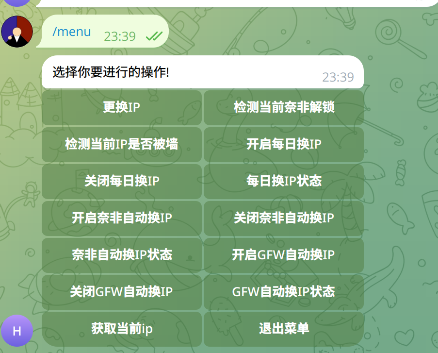

# 适用于家宽VPS 自动换IP 手动换IP 被墙换IP 掉解锁自动换IP  以及定时换IP
# Hinet HKT 动态


## 在国内端部署 GFW检测程序

```shell
sudo docker run -d -p 5000:5000  --restart unless-stopped --name checkip betteryjs/checkip

```

## 在 https://t.me/BotFather 创建通知机器人 
## 通过 https://t.me/getmyid_bot 获取私聊chat_id 或者 通过 https://t.me/get_id_bot 获取群组chat_id

## 提前将 Hinet的ip 解析到要设置ddns的域名上
## 克隆项目

```shell
git clone https://github.com/betteryjs/HinetChangeIPShare.git

cd HinetChangeIPShare
```

## 复制` config.json.exp` 到 `config.json` 修改其中字段

```shell

  "name": "Hinet-TW", # 填入通知名字
  "email": "xxxxxxx@gmail.com",  # 填入CF的个人邮箱
  "api_key": "xxxxxxxxxxxxxxxxx", # 填入CF的Global API Key	
  "domain": "example.xyz", # 填入ddns的主域名
  "changeHinetIpUrl": "填入商家给你的换ip的url", # 商家给你的换ip的url返回值是切换后的ip地址
  "TGBotAPI": "xxxxxxx", # 填入Botfather上面获取的TG bot token
  "chartId": "xxxxxx", # 填入上面获取的私聊chat_id或者群组chat_id
  "ddnsUrl": "hinet.example.xyz", # 填入要ddns的域名 先要吧Hinet的ip解析到要ddns的域名上
  "checknfport": "10241",           # 在机器上创建一个没有密码的sock5 节点 (xui/3xui) 设置端口后 后续通过这个sock5代理检测奈非解锁
  "checkgfwport": "10242", # 在机器上创建一个普通节点 写入端口号 后续通过这个TCP端口检测是否被墙
  "checkGFWUrl": "http://填入在国内端部署的GFW检测程序的IP:5000/checkip/", # 例如 http://1.1.1.1:5000/checkip/
  "changeIPCrons": "0 3 * * *", #每日换IP的crontab 时间 默认每天凌晨3点
  "checkNfGfwCron": "*/10 * * * *", # 奈非/被墙检测默认1分钟1次
  "authorized_users": ["AS99294837"]  # 授权Bot 的用户Username 就是去掉 @xxx 的xxx

```


## 在机子上安装python

```
apt install python3-pip python3-venv
```

## 创建虚拟环境 venv
```
python3 -m venv .venv
source .venv/bin/activate
```

## install requirements.txt

```
pip install -r requirements.txt
```


## 复制 service
```
cp  HinetTGBot.service  /lib/systemd/system/
chmod 644 /lib/systemd/system/HinetTGBot.service
systemctl start HinetTGBot.service
systemctl enable HinetTGBot.service
systemctl status HinetTGBot.service

```



